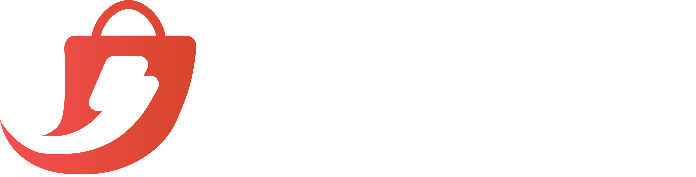
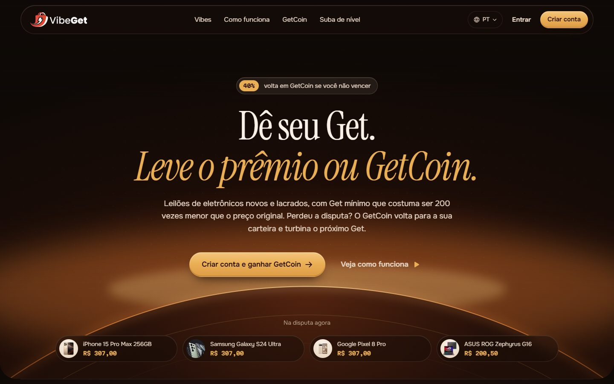
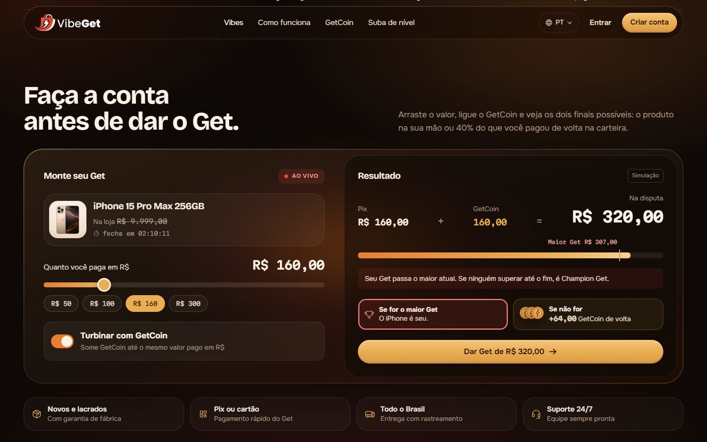
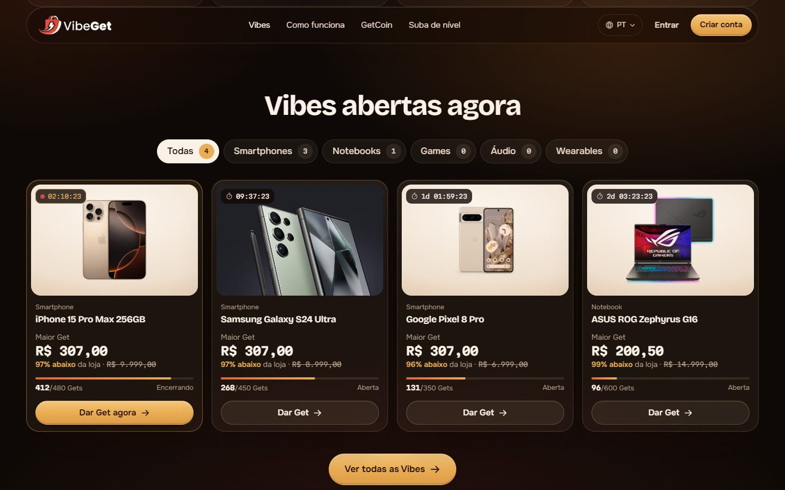
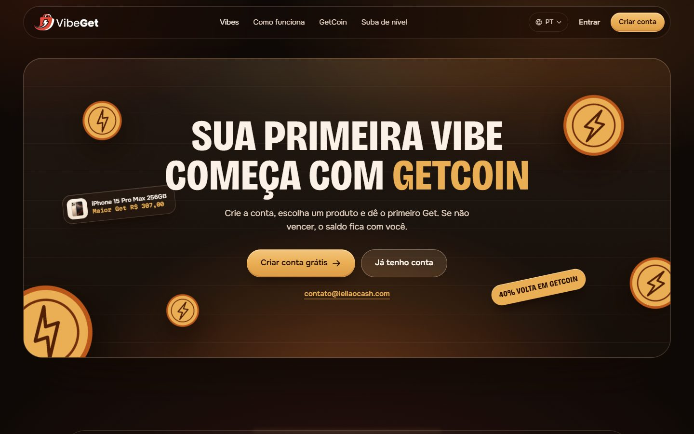

<div align="center">



# VibeGet · Redesign da página inicial

**Proposta de nova identidade visual e nova copy para [vibeget.net](https://vibeget.net), a plataforma de leilões de eletrônicos com GetCoin.**


</div>

<br />



## Sobre o projeto

O VibeGet é uma plataforma de leilões (as **Vibes**) de eletrônicos novos, lacrados e com garantia. O usuário dá um lance (o **Get**), pago via Pix ou cartão, e o maior Get leva o produto (o **Champion Get**). O diferencial é que ninguém sai de mãos vazias: quem não vence recebe **40% do valor pago de volta em GetCoin**, e esse saldo pode turbinar o próximo Get.

Este repositório reúne um **front-end de proposta**, feito para apresentar ao proprietário uma nova direção de marca para a página inicial:

- **Visual:** mais tech e mais quente, com glassmorphism, bordas arredondadas, cards e referências de criptomoeda.
- **Copy:** reescrita para explicar a mecânica em segundos, sem inventar números, depoimentos ou parceiros.
- **Conteúdo real:** logo, produtos, preços, regras e contatos vêm do site atual.

> [!NOTE]
> É uma proposta visual, sem back-end. Relógios, contagens de Gets e o extrato da carteira são **dados ilustrativos**. Os links de cadastro, login, produtos e páginas legais apontam para as páginas reais do vibeget.net.

## Seções da página

| Seção | O que faz |
| --- | --- |
| **Hero** | Fundo de tela cheia com uma moeda GetCoin nascendo no horizonte, título em serifa, selo "40% volta em GetCoin" e a faixa **Na disputa agora** com os produtos reais. |
| **Vibes ao vivo** | Faixa com as Vibes em andamento e o maior Get de cada uma. |
| **Simulador de Get** | O coração da proposta. O visitante escolhe o valor em R$, liga o **Turbinar com GetCoin** e vê na hora o total na disputa e uma barra que compara o Get dele com o maior Get atual. Mostra também os dois finais possíveis: o produto na mão, ou GetCoin de volta com as moedas empilhando. |
| **Vibes abertas agora** | Cards compactos de produto com relógio ao vivo, "% abaixo da loja", barra de meta de Gets e filtro por categoria com animação. Categoria vazia mostra um estado vazio com formulário de alerta validado. |
| **GetCoin** | Bento com os números da mecânica (**40%** e **1:1**) e o extrato da carteira como linha do tempo em 5 passos. |
| **Como funciona** | Trilha horizontal de 4 passos, do cadastro ao Champion Get. |
| **De Explorador a Viber** | Os níveis como cartões de membro físicos (chip, marca, metal escovado) com inclinação 3D que segue o cursor. |
| **Fechamento** | Painel de vidro com título condensado em caixa alta, moedas flutuando, adesivo "40% volta em GetCoin" e CTA. |
| **Footer** | Topo arredondado com brilho central, colunas de links e entrada animada. |

<table>
  <tr>
    <td></td>
    <td></td>
  </tr>
  <tr>
    <td align="center"><sub>Simulador de Get</sub></td>
    <td align="center"><sub>Vibes abertas agora</sub></td>
  </tr>
</table>



## Identidade visual

**Direção:** a *carteira cripto de vidro*. O GetCoin é tratado como um token, e o site como a carteira dele: vidro fosco iluminado por uma luz âmbar, sobre um fundo quase preto e quente.

### Paleta

| Cor | Hex | Uso |
| --- | --- | --- |
|  Brasa | `#0e0906` | Fundo da página |
|  Creme | `#fbf1e7` | Texto principal |
|  GetCoin | `#eaad53` | Acento único: botões, números e a moeda |
|  Chama | `#e67d33` | Gradientes e barras de progresso |
|  Ao vivo | `#d9483f` | Reservado para "Ao vivo" e Champion Get |

### Tipografia

- **Bricolage Grotesque** para títulos, incluindo a versão condensada do fechamento.
- **Instrument Serif** para o título da hero.
- **Onest** para textos corridos.
- **Martian Mono** para preços, relógios e valores, com números tabulares.

### Princípios

- Vidro com luz de verdade atrás: todo painel translúcido tem um brilho âmbar por trás para refratar.
- Uma cor de acento só: o dourado do GetCoin. O vermelho aparece apenas no que está ao vivo.
- Nada de números inventados: as promessas da página são as que o site atual já publica.
- Mobile primeiro: cards horizontais no celular e nenhuma rolagem lateral.
- Acessibilidade: link para pular ao conteúdo, foco visível, `prefers-reduced-motion` respeitado e textos alternativos nas imagens.

## Stack

- **[React 19](https://react.dev)** + **[Vite](https://vite.dev)**
- **CSS puro**, com tokens em variáveis CSS e sem framework de estilos
- **[Framer Motion](https://motion.dev)** para os botões magnéticos, o filtro animado e a entrada do footer
- **[Phosphor Icons](https://phosphoricons.com)** para os ícones
- **[Fontsource](https://fontsource.org)** para as fontes, servidas pelo próprio projeto

## Como rodar

Você precisa do [Node.js](https://nodejs.org) 18 ou mais recente.

```bash
# 1. Clone o repositório
git clone https://github.com/PedroAgostini/VIBEGET-REDESIGN.git
cd VIBEGET-REDESIGN

# 2. Instale as dependências
npm install

# 3. Rode em modo desenvolvimento
npm run dev
```

Abra o endereço que o Vite mostrar no terminal (em geral `http://localhost:5173`).

### Gerar a versão de produção

```bash
npm run build     # gera a pasta dist/
npm run preview   # serve o build localmente para conferir
```

A pasta `dist/` é estática e pode ser publicada em qualquer hospedagem: Vercel, Netlify, GitHub Pages ou um servidor comum.

## Estrutura

```
.
├── index.html            # HTML base com meta tags de compartilhamento
├── public/
│   ├── favicon.svg       # Ícone da moeda GetCoin
│   └── img/
│       ├── logo.png      # Logo oficial (vibeget.net)
│       ├── hero-bg.svg   # Arte da hero: GetCoin nascendo no horizonte
│       └── *.jpg/.webp   # Fotos de produto do catálogo atual
├── src/
│   ├── main.jsx          # Entrada da aplicação e fontes
│   ├── App.jsx           # Todas as seções da página
│   ├── data.js           # Catálogo de Vibes e utilitários de moeda
│   └── styles.css        # Tokens, componentes e responsivo
├── docs/                 # Capturas usadas neste README
├── PRODUCT.md            # Contexto do produto: público, regras e vocabulário
└── DESIGN.md             # Registro do sistema visual
```

## Vocabulário da marca

| Termo | Significado |
| --- | --- |
| **Vibe** | Um leilão |
| **Get** | Um lance |
| **Champion Get** | O lance vencedor |
| **GetCoin** | O saldo de cashback da carteira |
| **Viber** | Quem já venceu pelo menos uma Vibe |

## Próximos passos sugeridos

- Trocar a foto do Galaxy S24 Ultra por uma versão com fundo branco.
- Adicionar as fotos que faltam no catálogo (Xiaomi 14 Pro, MacBook Pro M3, Dell XPS 15, ThinkPad X1).
- Confirmar com o proprietário a regra dos selos de "% de cashback" por produto.
- Adicionar os perfis reais de redes sociais ao footer.
- Levar a mesma identidade para as páginas internas: produto, cadastro e Como funciona.

---

<div align="center">

Desenvolvido por **[Pedro Agostini](https://github.com/PedroAgostini)**

<sub>Proposta de redesign para o VibeGet. Marca, logo e produtos pertencem aos seus respectivos donos.</sub>

</div>
